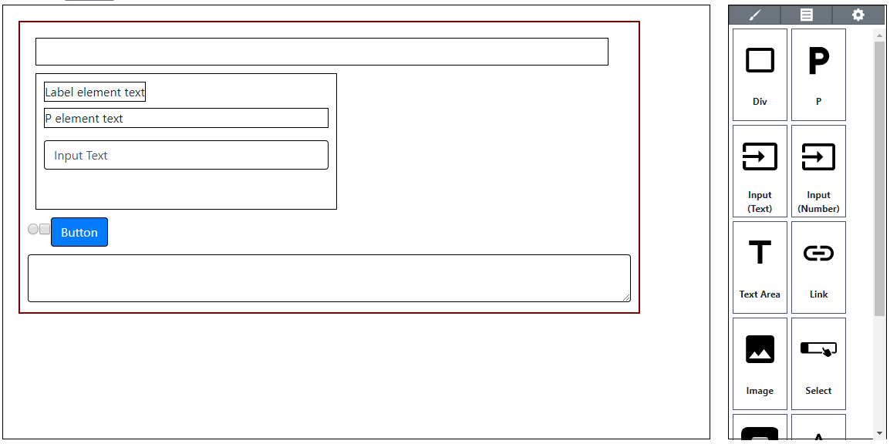
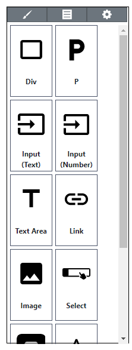
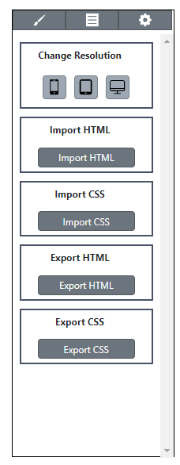

# HtmlBuilder(https://busungg.github.io/HtmlBuilder/) (Chrome)
 
 

## HtmlBuilder?

1. HtmlBuilder is web program and it will help you to make Layout of HTML.
2. You can set HTML layout on edit view.
3. You can export HTML, Style, CSS contents.
4. You can import HTML, CSS contens.

## Feature
1. Block

* You can drag HTML element to edit view and it will be added.  

2. Style & Attribute

* You can change attributes of selected element (id, title, name and etc...) 
* You can change class of selected element. 
* You can change styles of selected element. 
* 'Style to CSS' is function that can change styles of selected element to CSS element.  

3. Setting

* You can change resolution of edit view.  
* You can export HTML contents of edit view.  
* You can import HTML to edit view.  
* You can export CSS contens of edit view.  
* You can import CSS to edit view.   

## LICENSE
1. MIT

## Reference Site
1. GrapesJS (https://grapesjs.com/)
 
 
 

 
 
 

## HtmlBuilder?

1. HtmlBuilder는 HTML의 Layout 구성을 도와주는 Web 프로그램 입니다.
2. 편집 화면에서 HTML Layout을 구성 할 수 있습니다.
3. 편집 화면에서 구성한 HTML, Style, CSS을 Export 할 수 있습니다.
4. 기존 HTML 및 CSS를 Import 할 수 있습니다.

## 기능
1. Block

* HTML Element를 Drag하여 편집 View에 추가 할 수 있습니다.  

2. Style & Attribute

* 선택한 Element의 Attribute 값을 변경 할 수 있습니다. (id, title, name 등등) 
* 선택한 Element의 Class 값을 변경 할 수 있습니다. 
* 선택한 Element의 Style 값을 변 할 수 있습니다. 
* Style to CSS은 선택 Element의 Style을 지정한 이름의 CSS로 변경하는 기능 입니다.  

3. Setting

* 편집 화면의 Resolution을 변경합니다.  
* 편집 화면의 HTML을 Export 합니다.  
* 편집 화면에 기존 HTML을 Import 합니다.  
* 편집 화면의 CSS을 Export 합니다.  
* 편집 화면에 기존 CSS을 Import 합니다.   

## 라이센스
1. MIT

## 추천 사이트
1. GrapesJS (https://grapesjs.com/)
